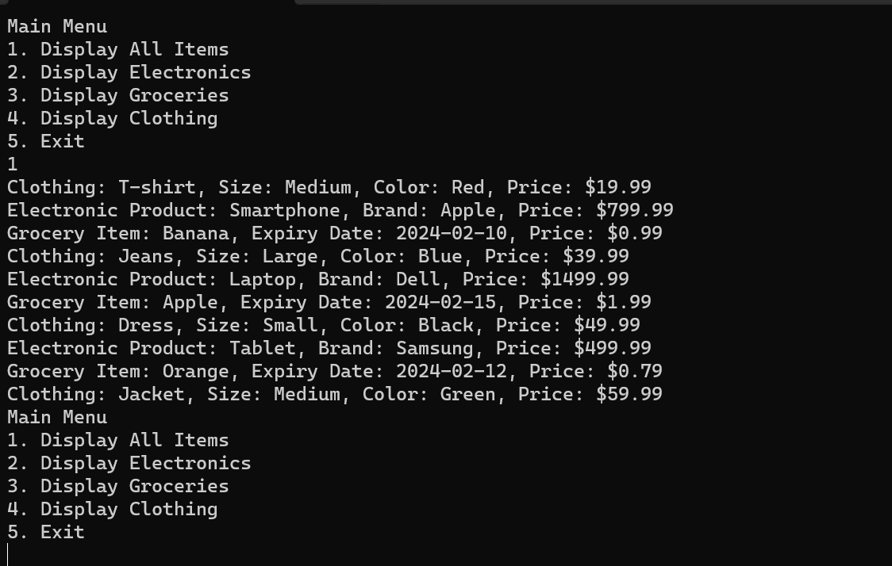

# Programming - Object Oriented Programming - Midterm - Part 1

Hello my ProCrammers!

This is part one of our midterm. Here you will walk through a step by step process for making a small application that connects to a **Database**. 

Along the way you learn how to use static classes and methods, inheritance, override, virtual, and other oop concepts.

There are questions during the tutorial that you need to answer. All your final answers must be placed on the [Questions](Questions.md) sheet located in the Solution.

You must also complete the whole assignment. Since Part 2 will have you create your own form of application with a **Database** and classes that exhibit the 3 pillars of objects oriented programming.

Along the way if you run into any issues, feel free to reach out, and I'll be happy to help. But follow the steps closely and you'll be fine. Absorb what's happening and ask questions. 

Cheers,
Will

---

### Table Of Contents

1. [Intro To Static](Training/Page1.md)
2. [Classes and Inheritance](Training/Page2.md)
3. [Abstract Class - Product](Training/Page3.md)
4. [Static Class `Config`](Training/Page4.md)
5. [Creating a menu (type of and GetType())](Training/Page5.md)

### [Questions](Questions.md)

Accessible UML:
- [Accessible U M L](Training/AccessibleUML.md)

---

## Requirements

1. Fork This Repository
    - Make sure it has your name at the end ( Prog_OOP_Midterm_Part1_YourName )
2. Comment your name at the top of Program.cs
3. Code must compile without any issues
4. Work through the full assignment
5. Answer all 28 questions in the [Questions](Questions.md)
    - This is not about memory but research and observation. Use the internet all you want. But you have to understand what you type down.
6. Submit this repo online

---

## Rubric

| Task                            | Description                                                | Points |
|---------------------------------|------------------------------------------------------------|--------|
| Forking the Repository          | Successfully forked the repository and included your name in the repository name. | 15     |
| Commenting Name in Program.cs   | Properly commented your name at the top of Program.cs.  | 5      |
| Code Compiles without Issues    | Code compiles and runs without any errors.               | 20     |
| Completing the Assignment       | Successfully worked through the full assignment.         | 60     |
| Answering All 28 Questions     | Thorough and accurate answers to all 28 questions in the Questions.md file. | 40     |
| Submission                      | Properly submitted the repository online.                | 10     |

Total Points: 150
