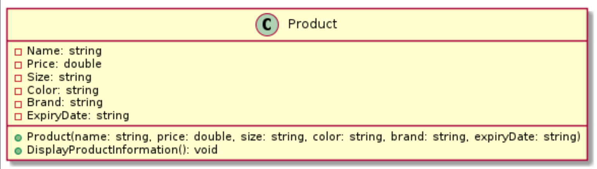
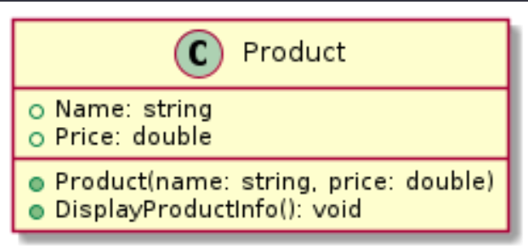
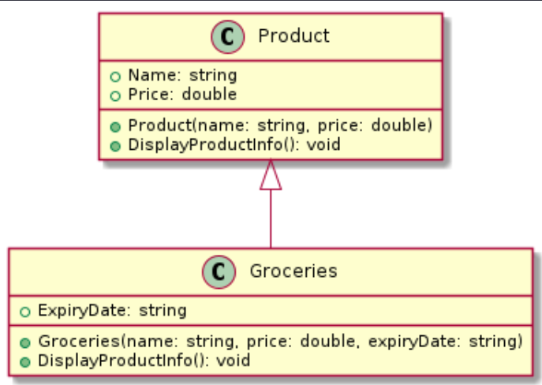
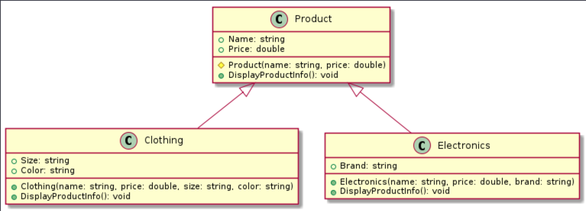

## [Home](../README.md)

# Part 2 - Classes and Inheritence 
---
## Classes

In programming everything basically boils down into two parts, Data and what you do with the data. If you are working with a client or business, you probably don't control what data comes in, but you will control how it is organized. 

Our client is ***Cramberry Farms***. They have a small business that is expanding and we are creating a small inventory system to display their data. Lets take a look at a sample of their database.

`Cramberry Farms Training Database - Product`

| Name      | Price   | Size    | Color  | Brand   | Expiry Date |
|--------------|---------|---------|--------|---------|-------------|
| T-shirt      | $19.99  | Medium  | Red    |         |             |
| Smartphone   | $799.99 |         |        | Apple   |             |
| Banana       | $0.99   |         |        |         | 2024-02-10  |
| Jeans        | $39.99  | Large   | Blue   |         |             |
| Laptop       | $1499.99|         |        | Dell    |             |
| Apple        | $1.99   |         |        |         | 2024-02-15  |
| Dress        | $49.99  | Small   | Black  |         |             |
| Tablet       | $499.99 |         |        | Samsung |             |
| Orange       | $0.79   |         |        |         | 2024-02-12  |
| Jacket       | $59.99  | Medium  | Green  |         |             |


Here we see a sample of their products. Notice the column names ( the top line ). 
- Name
- Price
- Size
- Color
- Brand
- Expiry Date

This is a good place to start. Lets look at what this would look like as a class


**1. Define the Data Structure:**

Before creating classes and inheritance, it's essential to define the data structure you'll be working with. Let's assume we are dealing with products, and each product has common attributes such as `ID`, `Name`, `Price`, and `Manufacturer`. Additionally, groceries may have specific attributes like `ExpirationDate`, and electronics may have attributes like `Voltage`.

`Our product UML`


For an accesible version of a UML document for the full page. Click [Accessible U M L](AccessibleUML.md).

**3. Create the Product class with all fields:**

1. Create a class Product with the following code.

```csharp
public class Product
{
    public string Name { get; set; }
    public double Price { get; set; }
    public string Size { get; set; }
    public string Color { get; set; }
    public string Brand { get; set; }
    public string ExpiryDate { get; set; }

    public Product(string name, double price, string size, string color, string brand, string expiryDate)
    {
        Name = name;
        Price = price;
        Size = size;
        Color = color;
        Brand = brand;
        ExpiryDate = expiryDate;
    }

    public void DisplayProductInformation()
    {
        Console.WriteLine("Product Information:");
        Console.WriteLine($"Name: {Name}");
        Console.WriteLine($"Price: ${Price}");
        Console.WriteLine($"Size: {Size}");
        Console.WriteLine($"Color: {Color}");
        Console.WriteLine($"Brand: {Brand}");
        Console.WriteLine($"Expiry Date: {ExpiryDate}");
    }
}

```

**4. Test with a single object in Program:**

In program let's test our class with a row from our Sample data.

| Name      | Price   | Size    | Color  | Brand   | Expiry Date |
|--------------|---------|---------|--------|---------|-------------|
| T-shirt      | $19.99  | Medium  | Red    |         |             |

Enter in the information from a above, use an empty string for blank squares.

`Program.cs`
```csharp
Product product = new Product("T-shirt ", 19.99, "Medium", "Red", "", "");

product.DisplayProductInformation();
```

### Output

```console
Product Information:
Name: T-shirt
Price: $19.99
Size: Medium
Color: Red
Brand:
Expiry Date:
```

This isn't good. It looks formatted, but we have blank data. That's because our Product class is trying to do too much. It's trying to represent a Clothing Item, an Electrical Item, AND a Grocery Item at the same time.

This goes against `encapsulation`, or keeping only the relevant fields contained in their classes. Let's fix that.

### Question 9: What is encapsulation?
### Question 10: What are the other two, or 3 depending on the source, pillars of object oriented programming?

### Inheritance

Let's take a look at our data again and see if we can't break it down.

Is there some data that we see that ALL products have in common? Yes, you should notice that every product has a ***Name*** and ***Price***. So lets refactor product.

`Cramberry Farms Training Database - Product`

| Name      | Price   | Size    | Color  | Brand   | Expiry Date |
|--------------|---------|---------|--------|---------|-------------|
| T-shirt      | $19.99  | Medium  | Red    |         |             |
| Smartphone   | $799.99 |         |        | Apple   |             |
| Banana       | $0.99   |         |        |         | 2024-02-10  |
| Jeans        | $39.99  | Large   | Blue   |         |             |
| Laptop       | $1499.99|         |        | Dell    |             |
| Apple        | $1.99   |         |        |         | 2024-02-15  |
| Dress        | $49.99  | Small   | Black  |         |             |
| Tablet       | $499.99 |         |        | Samsung |             |
| Orange       | $0.79   |         |        |         | 2024-02-12  |
| Jacket       | $59.99  | Medium  | Green  |         |             |

---

**5. Refactor ( recode ) our Product class**

So let's refactor our `Product.cs` class, knowing it will be inherited from.



`Product.cs`
```csharp

    public class Product
    {
        public string Name { get; set; }
        public double Price { get; set; }

        public Product(string name, string price) {
            Name = name;
            Price = price;
        }

        public virtual void DisplayProductInfo()
        {
            Console.WriteLine("Product Information:");
            Console.WriteLine($"Name: {Name}");
            Console.WriteLine($"Price: {Price}");
        }

    }
```

#### Question 11: After our refactor of Product, it only has fields that are _blank_ among all the Objects in the database.
#### Question 12: We made our DisplayProductInfo() method `virtual`. What does virtual do?
#### Question 13: Why do you think we made that method virtual ( only wrong answer is a blank answer. Give it a shot. )?

---

Looking at our Data one more time, let's see if we can see some common categories.

`Cramberry Farms Training Database - Product`

| Name      | Price   | Size    | Color  | Brand   | Expiry Date |
|--------------|---------|---------|--------|---------|-------------|
| T-shirt      | $19.99  | Medium  | Red    |         |             |
| Smartphone   | $799.99 |         |        | Apple   |             |
| Banana       | $0.99   |         |        |         | 2024-02-10  |
| Jeans        | $39.99  | Large   | Blue   |         |             |
| Laptop       | $1499.99|         |        | Dell    |             |
| Apple        | $1.99   |         |        |         | 2024-02-15  |
| Dress        | $49.99  | Small   | Black  |         |             |
| Tablet       | $499.99 |         |        | Samsung |             |
| Orange       | $0.79   |         |        |         | 2024-02-12  |
| Jacket       | $59.99  | Medium  | Green  |         |             |

- We see T-shirt and Jeans both have Size and Color, those could be `Clothing`.
- We see Smartphone and Laptop both have a brand, those could be `Electonics`.
- And finally we see Banana and Apple both have an Expiry Date, those look like `Groceries`.

Those sound like good `dervied` classes of Product to me. Let's get to it.

#### Question 14: What does dervied mean in the context of inheritence?
#### Question 15: Is one class is derived, the class that it derives from is considered the "b___" class. What is it?


---

Now let's create our first derived class.

`Groceries UML`


**6. Create a derived class, Groceries:**

Let's start with creating our first derived, or child, class.

1. Create a new class called `Groceries.cs` and inherit from `Product`.

2. Add the following code.

```csharp
public class Groceries : Product
{
    public string ExpiryDate { get; set; }

    public Groceries(string name, double price, string expiryDate) : base(name, price)
    {
        ExpiryDate = expiryDate;
    }

    public override void DisplayProductInfo()
    {
        Console.WriteLine($"Grocery Item: {Name}, Expiry Date: {ExpiryDate}, Price: ${Price}");
    }
}
```

#### Question 16: When inheriting from a parent class, which class member ( field, constructor, properties, or method ) do you HAVE to create in your child class?
#### Question 17: Our constructor has the syntax `    public Groceries(string name, double price, string expiryDate) : base(name, price)`. What is this for?
#### Question 18: For our DisplayProductInfo() we now used the word `override` instead of `virtual`. Why is that? And what happens if we take the word `virtual` away from the method inside of Product?

---

Your code on main program is now yelling at you. Let's change it so we can test our new Grocery class out.

**7. Test with a single grocery product:**

```csharp
class Program
{
    static void Main(string[] args)
    {
        // Create a new instance of Groceries
        Groceries banana = new Groceries("Banana", 0.99, "2024-02-10");

        // Call the DisplayProductInfo method to display the banana's details
        banana.DisplayProductInfo();
    }
}

```

Output:
```console
Grocery Item: Banana, Expiry Date: 2024-02-10, Price: $0.99
```

That's better! Now we don't have any blank fields. Let's do the same for our 2 other categories.

#### Question 19: Because we inherited from Parent, what class members did we get access to in Groceries?
#### Question 20: What access modifer is needed for everything in your project to have access to class members ( there are 2 that would work )?

---

You've seen how we built `Groceries.cs`. Now I'm going to give you the UML of the last two derived classes. You can build them yourself.

**8. Create Product and Electronics classes:**




**9. Test with all three products:**

Now we return to our `Program.cs` to test our code.

```csharp
// Testing Clothing
Clothing tShirt = new Clothing("T-shirt", 19.99, "Medium", "Red");
tShirt.DisplayProductInfo();

// Testing Electronics
Electronics smartphone = new Electronics("Smartphone", 799.99, "Apple");
smartphone.DisplayProductInfo();

// Testing Groceries
Groceries banana = new Groceries("Banana", 0.99, "2024-02-10");
banana.DisplayProductInfo();

```

Output

```console
Clothing: T-shirt, Size: Medium, Color: Red, Price: $19.99
Electronic Product: Smartphone, Brand: Apple, Price: $799.99
Grocery Item: Banana, Expiry Date: 2024-02-10, Price: $0.99
```

That looks good! All information is showing correctly and it's only showing the relevant information. Let's get this into a list.

#### Question 21: When each instanced object called `DisplayProductInfo()` the output was different based on the object. Why is that?

---

Now that we have our classes properly setup let's go ahead and get them all into a list for ease of access.

**10. Create a list of Product and add all products to it:**

Create a list of Product, and add the products we just created.

```csharp
List<Product> productList = new List<Product>();
productList.Add(tshirt);
productList.Add(smartphone);
productList.Add(banana);

foreach(Product product in productList) {

    product.DisplayProductInfo();
}
```


Output:
```console
Clothing: T-shirt, Size: Medium, Color: Red, Price: $19.99
Electronic Product: Smartphone, Brand: Apple, Price: $799.99
Grocery Item: Banana, Expiry Date: 2024-02-10, Price: $0.99
```

This looks great! We now have our data organized into classes, and our classes loaded into a list.

The last step, let's replace our List\<string\> string inside of the MyDatabase class.

#### Question 22: What were we able to store our child classes in a list of Product?
#### Question 23: We were able to call DisplayProductInfo() on every object, even though each object was directly a Product. Why is that?
#### Question 24: If I tried to access the `Expiry Date` field of a product, what would happen? Why would it happen?

---

**11. Move your list of Products to your MyDatabase class.**

Keep an eye out below, we refactored our code to become a list of Product. Observe what we changed, removed and added.

```csharp
using System;
using System.Collections.Generic;

public static class MyDatabase
{
    private static List<Product> data; // Static field

    static MyDatabase()
    {
        Console.WriteLine("The list is loading");
        Clothing tShirt = new Clothing("T-shirt", 19.99, "Medium", "Red");
        Electronics smartphone = new Electronics("Smartphone", 799.99, "Apple");
        Groceries banana = new Groceries("Banana", 0.99, "2024-02-10");

        data.Add(tshirt);
        data.Add(smartphone);
        data.Add(banana);

    }

    public static List<Product> Data // Static property
    {
        get { return data; }
    }
}
```

Now to test it out in Program.

```csharp
using System;

class Program
{
    static void Main()
    {
        // Access the static property to get the data
        List<Product> dataList = MyDatabase.Data;

        // Display the data from the static class
        foreach(Product product in productList) {

            product.DisplayProductInfo();   
        }
    }
}
```

Output:
```console
    Clothing: T-shirt, Size: Medium, Color: Red, Price: $19.99
    Electronic Product: Smartphone, Brand: Apple, Price: $799.99
    Grocery Item: Banana, Expiry Date: 2024-02-10, Price: $0.99
```

That's great! We now have our "database" updated to use our classes. The next step is to change our Product class to be abstract, since we don't plan to have any instances of Product floating around.

[Page3](Page3.md)