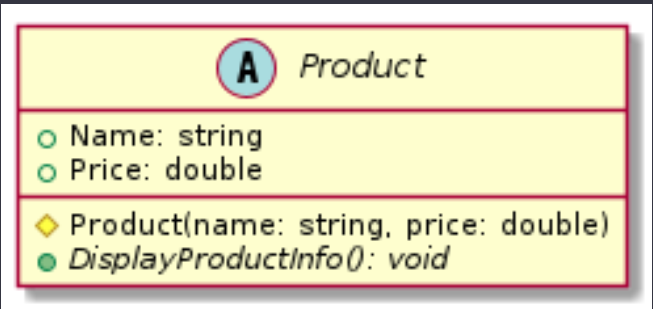

## [Home](../README.md)

# Page 3 - Abstract Class - Product

Now that we have our classes organized let's consider making things a little more efficent.

We are going to convert our `Product.cs` class into abstract. By converting the class into abstract it prevents others from creating an instance of Product. Which is fine, since everything in our database should fall into one of our derived classes.

Abstract still allows children to inherit from them though.


---

Below is what our Product class looks like as abstract in our UML. Notice the A instead of a C. Also observe that the DisplayProductInfo() name is in italics. This indicates it is an abstract method.



**1. Convert Product into an abstract class:**

1. Open our `Product.cs` class and
    - Add the abstract keyword in front of class
    - Make the constructor protected.
    - Make the DisplayProductInfo() method abstract and remove the method body.

And, let's modify the `DisplayInfo` method to be an abstract method within the `Product` class:

This change makes it mandatory for any class that derives from `Product` to provide its own implementation of the `DisplayInfo` method. 

```csharp
    // Abstract parent class for products
    public abstract class Product
    {
        protected Product(string name, double price)
        {
            Name = name;
            Price = price;
        }

        public string Name { get; set; }
        public double Price { get; set; }
        public abstract void DisplayProductInfo();
    }
```

By marking the `Product` class as `abstract`, you're indicating that it cannot be instantiated directly. Instead, it serves as a base class for other classes that inherit from it, such as `Groceries` and `Electronics`.

#### Question 22: What does the abstract keyword do exactly? What does it prevent?
#### Question 23: The abstract method no longer has a body, why is that? We also removed the word virtual, how do virtual and abstract relate?
#### Question 24: We turned our constructors accesible type to `protected. What objects have access to the constructor now that it's `protected`. And since we turned our class `abstract` why doesn't it matter that we can't create new instance of `Product` in main?
#### Question 25: The other classes didn't need to be changed. Specifically the DisplayProductInfo() didn't need any changing when we swapped our method from virtual to abstract. Why?

---

