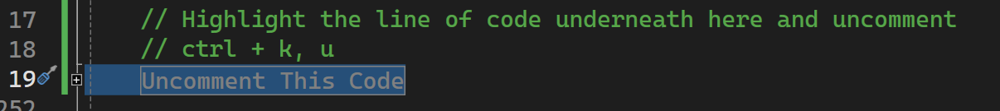
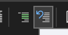

## [Home](../README.md)

## !! Important

Go into `Database.cs`. You should see a single line of code on 19 that says `Uncomment this code`


Highlight this code and UNCOMMENT ALL. 
- Hotkey - Ctrl + K, U

or

- Uncomment Button - 

If there's more than a single line of code, click the small plus next to the Line that says `Region` to condense it all.

This step is important or the database will not function correctly.

# Part 4 - Static Class `Config`

Another use for a static class is a shared class of information that you might use all over your application.

Right now we only have a few classes and one main class that we run everything from, `Program.cs`. But in the future your application can have hundreds or thousands of classes. Making a class that is a seperate instance across all your pages runs the very likely risk that you will have inconsistent data across your app. We want to avoid that.

Here we create a new static class called `Config`. This class will hold data we might reuse over and over again. And if we had to update it in the future, we could update it in one place, instead of across multiple pages.


---

**1. Create a new class `static Config`:**

1. Start by creating a new class called `Config`. Make sure it is static.


```csharp
public static class Config
{
    // Insert Code here
}
```

---

**2. Introduce the connection string:**

In Computer Science our applications don't hold large collections of data in memory, as that's extremely resource intensive. We tend to keep data secured in a database ( usually using SQL Server, Oracle, etc..). Databases are a system meant specifically to maintain, and work with data.

We connect our application, which pulls and manipulates data, by using what is known as a "connection string". This string is bascially a series of variables and their values all grouped together.

### Example Connection String
```csharp
string connectionString = "Driver={SQL Server Native Client 11.0};Server=CramberryFarms;Database=test;Uid=admin;Pwd=password;";
```

Take a look. Use what you know and see if you can see the variable names, the values, and what seperates them.

- Driver={SQL Server Native Client 11.0};
- Server=CramberryFarms;
- Database=test;
- Uid=admin;
- Pwd=password;

Everything is seperated by a semi-colonm ;. And then we have the variable name, followed by the value. That's it!

When we pass the connection string in, the server on the other side knows how to break that string apart into it's seperate parts, and pass the data into the correct places. If the information relayed is correct, you connect to your database.

This is a simplification of a how database works, but the logics there. Connect to a database, then we can pull the data.

Let's take a look at setting up our Connection string for use.

---

**3. Create a connection string field:**

We've created a private static field called `connectionString` to store the connection string value.

```csharp
public static class Config
{
    // Fields for configuration settings
     public static string ConnectionString { get; private set; }
}
```

#### Question 26: We set our set to private. What does private? And why might we want to set our set to private for our connection string ( take a guess )? 

---

**4. Create a method to update the connection string field:**

If we take a look at a connection string again...
```csharp
string connectionString = "Driver={SQL Server Native Client 11.0};Server=CramberryFarms;Database=test;Uid=admin;Pwd=password;";
```

There's a lot of oppertunity to mistype that. And connections strings are case sensitive. So what we want to do is make it as easy as possible to format that connection string. How do we do this? Lets create a method that let's us pass in only the relevant information.

Write the following code ***EXACTLY***

```csharp
public static class Config
{
    // Fields for configuration settings
    private static string connectionString;

    // Update Config Information

    public static void UpdateConnectionString(string server, string database,  string userName, string password)
    {
        string driver = "Driver={SQL Server Native Client 11.0};";
        string serv = $"Server={server};";
        string db = $"Database={database};";
        string userId = $"Uid={userName};";
        string pass = $"Pwd={password}";

        ConnectionString = $"{driver}{serv}{db}{userId}{pass}";
    }
}
```

Did you see what we did?

- We created a static method that took ONLY the values we need to change. 
- Then we declared variables to easily be able to read our data ( great for when your working on a team with teammates ). 
- We concatenate the string it's it's final format and change the field.
- That's why we made the connectionString field set private, because we provide a more fail safe method for updating the string.

---

**5. Test with a database connection:**

Now let's put our connection string and classes to use!

Go back to main and let's update the code so instead of pulling from your `MyDatabase` class. We will pull from the `Database` class.

You can use the `GetConnectionString` method to retrieve the current connection string from the `Config` class and use it to connect to a database or perform any other relevant operation in your application.

So we have to follow the correct steps. First, we update the Config file with the correct connection information. Here is the important information needed.

| Key            | Value                            |
|----------------|----------------------------------|
| Driver         | {SQL Server Native Client 11.0}; |
| Server         | CramberryFarms                   |
| Database       | training                         |
| Uid            | Admit                            |
| Pwd            | 1234                             |


```csharp
using System;
using System.Data.SqlClient;

class Program
{
    static void Main()
    {
            // Using our UpdateConfig method to change our connection string. Make sure to pass in the correct information
            Config.UpdateConnectionString("CramberryFarms", "training", "Admin", "1234");

            // Saving the connectionString to a local variable
            string connectionString = Config.ConnectionString;

            // Using the Database.ConnectToDatabase() method that takes a formatted connection string to connect
            Database db = Database.ConnectToDatabase(connectionString);

            // If it connects, grab the data as a list of product
            // In the real world theres a lot of framework and code to make this happen
            List<Product> data = db.Data();

            // Display our list of product from the training table.
            foreach (Product d in data)
            {
                d.DisplayProductInfo();
            }
}
```

Run the code!

Output:

```console
    Clothing: T-shirt, Size: Medium, Color: Red, Price: $19.99
    Electronic Product: Smartphone, Brand: Apple, Price: $799.99
    Grocery Item: Banana, Expiry Date: 2024-02-10, Price: $0.99
    Clothing: Jeans, Size: Large, Color: Blue, Price: $39.99
    Electronic Product: Laptop, Brand: Dell, Price: $1499.99
    Grocery Item: Apple, Expiry Date: 2024-02-15, Price: $1.99
    Clothing: Dress, Size: Small, Color: Black, Price: $49.99
    Electronic Product: Tablet, Brand: Samsung, Price: $499.99
    Grocery Item: Orange, Expiry Date: 2024-02-12, Price: $0.79
    Clothing: Jacket, Size: Medium, Color: Green, Price: $59.99
```

Looks like we are connected!

Now for the final step, lets make an app to work with this.

[Page5](Page5.md)