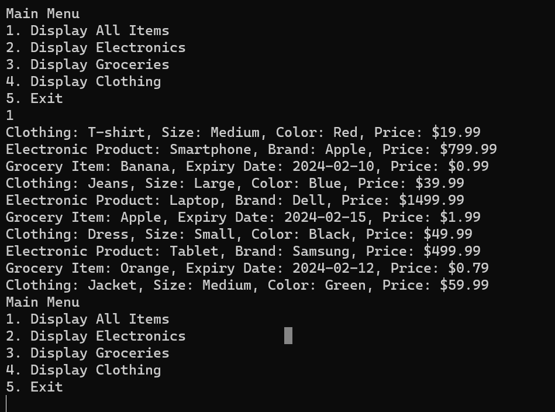
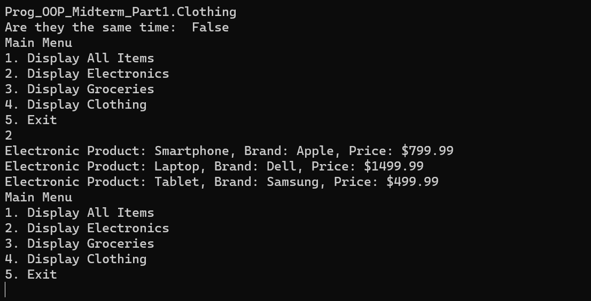

## [Home](../README.md)

## Part 5 - Creating a menu ( type of and GetType() )

Now that we can connect to our data, let's create a small menu that will let us display all the product, or just certain categories.

 ---

**1. Create a menu to display all items:**

First Write the code below. This is a standard menu.

```csharp
// In your Program.cs
using System;

class Program
{
       static void Main()
        {

            // Update Connection String
            Config.UpdateConnectionString("CramberryFarms", "training", "Admin", "1234");
            // Save connection String locally
            string connectionString = Config.ConnectionString;

            // Connect to database
            Database db = Database.ConnectToDatabase(connectionString);

            // Pull the data
            List<Product> data = db.Data();

            // Menu -------------------------------------

            bool exit = false;

            while (!exit)
            {
                Console.WriteLine("Main Menu");
                Console.WriteLine("1. Display All Items");
                Console.WriteLine("2. Display Electronics");
                Console.WriteLine("3. Display Groceries");
                Console.WriteLine("4. Display Clothing");
                Console.WriteLine("5. Exit");

                int choice = int.Parse(Console.ReadLine());

                switch (choice)
                {
                    case 1:
                        DisplayAllItems(data);
                        break;
                    case 2:
                        // DisplayElectronics();
                        break;
                    case 3:
                        // DisplayGroceries();
                        break;
                    case 4:
                        // DisplayClothing();
                        break;
                    case 5:
                        exit = true;
                        break;
                    default:
                        Console.WriteLine("Invalid choice. Please try again.");
                        break;
                }
            }
        }

        static void DisplayAllItems(List<Product> data)
        {
            // Code to display all items

        }

        static void DisplayElectronics(List<Product> data)
        {
            // Code to display all Electronics
        }

        static void DisplayGroceries(List<Product> data)
        {
            // Code to display all Groceries
        }

        static void DisplayClothing(List<Product> data)
        {
            // Code to display all Clothing

        }
}
```

--- 

**2. Our Display All Method**

Notice with our methods we are passing in a list of product. That's going to be our `data` that we pulled from the database.

Inside of this method we are going to put the same exact foreach loop we used to test initially.

```csharp
    static void DisplayAllItems(List<Product> data)
    {
        foreach(Product product in data) {
            product.DisplayProductInfo();
        }

    }
```

And let's test our code.



It works!! We see it print everything, each product regardless if it's clothing, electronics, or grocery.

Now let's make give it the ability to filter.

---

** Information: GetType and typeof **

With inheiritance we can actually check to see if something is a particular type. There are 2 important methos we need, .GetType() and typeof().

GetType() is used on an object to return the type. And typeof() can be used when checking to see two objects are the same type.

Below our `List\<Product\> data = db.Data(); add the following code.

```csharp
// In your Program.cs
using System;

class Program
{
       static void Main()
        {
            // Other code...

            // Pull the data
            List<Product> data = db.Data();

            // Saving a reference to an object in our list
            Product testGetType = data[0];

            // Display the type of the object
            Console.WriteLine(testGetType.GetType());

            // Saving a local variable holding the type of a specific object, here groceries.
            Type groceryType = typeof(Groceries);

            // Comparing GetType to typeof(Groceries)
            bool sameType = testGetType.GetType() == groceryType;

            // Printing the result
            Console.WriteLine($"Are they the same time:  {sameType}");

            // Menu
            .
            .
            .
        }
```

Using `object.GetType()` will return the `Type` of the object. Since this was made as a `new Clothing` it says the clothing type. It doesn't matter if it's saved in a list of product, it's still the type we declared.

```console
    Prog_OOP_Midterm_Part1.Clothing
```

We can check to see if something is a certain type using the method `typeof()`.

`Demonstration only, you don't need to add it`
```csharp
    Grocery groObject = new Grocery(....);
    bool isGroceryObject = groObject.GetType() == typeof(Grocery);
    Console.WriteLine(isGroceryObject); // Returns true

    bool isClothingObject = groObject.GetType() == typeof(Clothing);
    Console.WriteLine(isClothingObject); // Returns false
```


Now, delete that code we just added, and filter our results.

---

**3. Filtering our database results**

In the Display Electronics method lets add the same code from our display all method.

And lets wrap our `product.DisplayProductInfo()` in a condition, where only IF our item is an electronic, display it.

```csharp

    static void DisplayElectronics(List<Product> data)
    {
        foreach(Product product in data) {
            if(product.GetType() == typeof(Electronic) {
                product.DisplayProductInfo();
            }
        }
    }
```

Uncomment the DisplayElectronics method in our menu and test it out.



It works! We have filtered our results by the type

#### Question 27: What method is used to get the TYPE of an instance of an object?
#### Question 28: What method can we use to if one type is another?

### Final Step!

In your `Config.UpdateConnectionString()` change the database from training, to main to load the full database.

```csharp
    // Update Connection String
    Config.UpdateConnectionString("CramberryFarms", "main", "Admin", "1234");
```

---

Finish it up by finish up the final two methods.

When your all done, finish up answering the questions and submit your repository on canvas. You've just completed Part 1.

Now you get to build something yourself.

